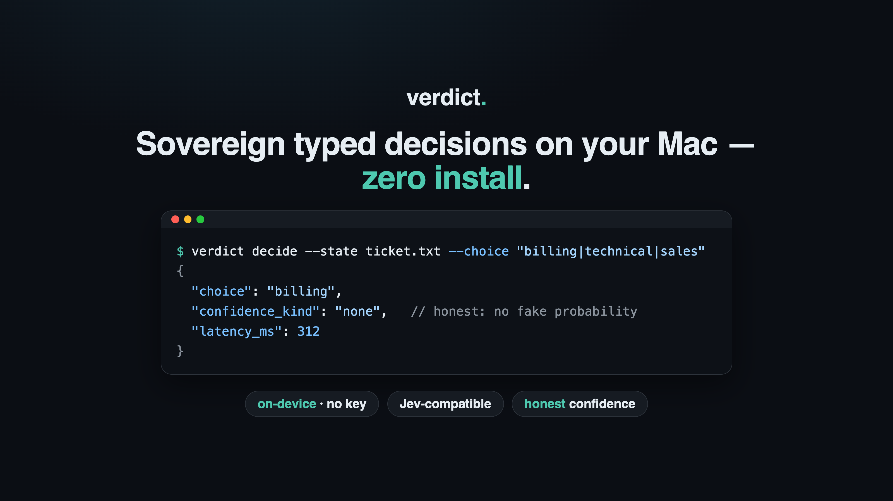

# verdict

> **Sovereign typed decisions on your Mac — zero install.**

Ask a piece of text a typed question — *pick one of these*, *score on a rubric*, *yes or no* — and get a typed answer back, on-device, with an honest confidence label. verdict runs the Apple Foundation Model already in macOS 26, speaks TypeSafe Jev's `POST /v1/systemone`, and never claims a calibrated probability it doesn't have.

   



## Install

```bash
brew install NakliTechie/tap/verdict
verdictd install       # per-user launchd agent, up at login, no sudo
```

Apple Silicon, macOS 26+, Apple Intelligence enabled. The default backend is the OS model, so there is **no model download, no API key, no network**. (An optional Laya backend does need a ~0.8 GB download — see Backends.) Prefer source? `git clone … && swift build -c release`.

## Use it

Three doors, one core.

```bash
# CLI — a typed answer as JSON
verdict decide --state note.txt --choice "billing|technical|sales" --ask "Which team handles this?"

# HTTP — Jev-compatible; a client written for Jev works unchanged
TOKEN=$(verdictd token)
verdict decide --example | curl -s http://127.0.0.1:7311/v1/systemone \
  -H "Authorization: Bearer $TOKEN" -H 'Content-Type: application/json' -d @-
```

```swift
// Library (SwiftPM)
import VerdictCore
let r = try await Verdict(backend: FoundationModelsBackend()).decide(request)
```

Dataflow (second door): `verdictd watch --db events.sqlite --topology topology.json` reads a `pending` events table, answers each event's questions, writes a `decisions` table you join in SQL. Full guide: [docs/INTEGRATION.md](docs/INTEGRATION.md).

## Why it's different

- **Sovereign, zero install** — the default backend *is* the OS model. Nothing to download, no server to run for a caller, no key, no bytes leave the Mac.
- **Honest about confidence** — every answer carries `confidence_kind`: `decoded` (a real probability), `agreement` (sampled-vote share), or `none` (a single greedy run, confidence `null`). verdict never prints a number it can't stand behind. The field has been shown to be right to distrust: hosted Jev fails calibration on 7 of 8 tabular datasets ([predict_addict](https://x.com)).
- **Jev-compatible** — the same `POST /v1/systemone`; a Jev / openjev client runs locally, unchanged.
- **Two doors, one core** — request/response and a SQLite dataflow operator, same typed contract.

## Use something else if

- **You need a calibrated probability to threshold on.** verdict-fm gives none; a recalibrated logprob engine (e.g. a 4B model via [llamacpp-jev](https://github.com/NakliTechie/llamacpp-jev)) is the better fit. See [docs/COMPARISON.md](docs/COMPARISON.md).
- **You're not on Apple Silicon / macOS 26.** verdict-fm needs the OS model.
- **Your task is wide retrieval** ("which of 100 topics"). Plain BM25 beats verdict there (33/40 vs 28/40 on our routing set); verdict is for *narrow* typed decisions.

## Backends

Selected per request via `model` on the wire:

- **`verdict-fm`** (default) — Apple Foundation Models, guided generation, schema-valid answers, no probability. Best answer accuracy in our benchmarks; zero install.
- **`verdict-laya`** (optional) — Laya typed-decisions via Core ML (`aac6fef/laya-typed-decisions-coreml`, Apache-2.0, ~0.8 GB download). Returns a decoded probability distribution. Measure its calibration on your own data first.

## Verify it yourself

```bash
swift test                                                  # 55 tests, 11 suites
verdict bench                                # warm latency per backend on your Mac
verdict replay <fm-bench>/fixture.json --gate 26   # the accuracy gate
```

Benchmarks and the honest "not better than the rest" boundary: [docs/COMPARISON.md](docs/COMPARISON.md).

## Pointers

[SPEC.md](SPEC.md) (contract) · [docs/INTEGRATION.md](docs/INTEGRATION.md) (call it) · [docs/COMPARISON.md](docs/COMPARISON.md) (numbers) · [llms.txt](llms.txt) (agent face)

## License

MIT — see [LICENSE](LICENSE).
